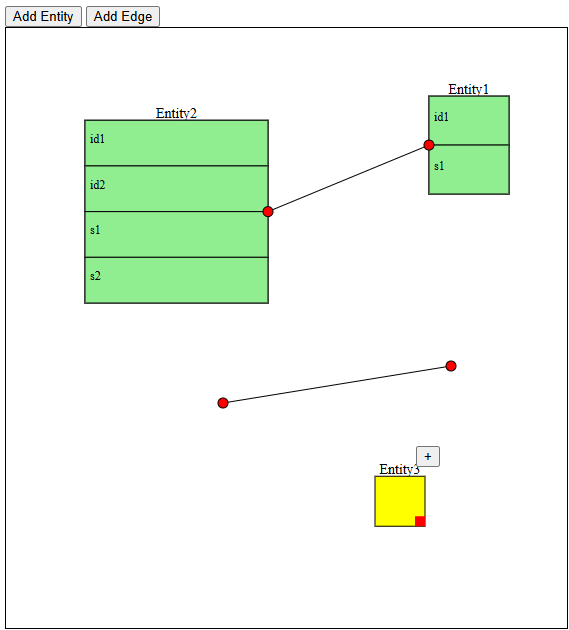

# Курсовая 2024. Разработка редактора ER и реляционных моделей.

## Функционал

### Add Entity — добавить сущность

Сущность в системе обладает следующими возможностями:
- **Выделение**: можно выделить сущность, щелкнув по ней.
- **Перемещение**: можно перемещать сущность по рабочему пространству.
- **Изменение размера**: с помощью "ручки" в правом нижнем углу можно изменять размер сущности.
- **Добавление атрибутов**: можно добавить атрибуты к сущности, включая:
  - **Идентификатор** (например, уникальный ID сущности)
  - **Обычные атрибуты** (например, имя, тип данных и другие свойства)
- **Оптимизация привязанных ребер**: при перемещении сущности автоматически изменяется положение привязанных к ней ребер, чтобы они оставались привязанными к сущности с оптимальным расположением.

### Add Edge — добавить ребро

Ребро в системе поддерживает следующие функции:
- **Выделение**: ребро можно выделить, щелкнув по нему.
- **Перемещение**: ребро можно перемещать, если оно не привязано к сущности.
- **Привязка к сущности**: можно привязать одно из концов ребра к сущности.
- **Связывание сущностей**: можно связывать сущности между собой, перетаскивая концы ребра, создавая таким образом связь между двумя сущностями.

## Демонстрация работы

